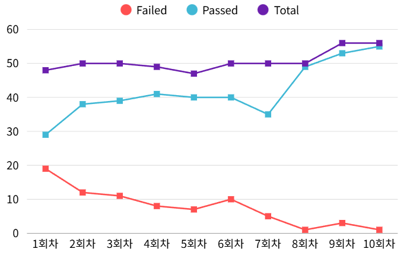
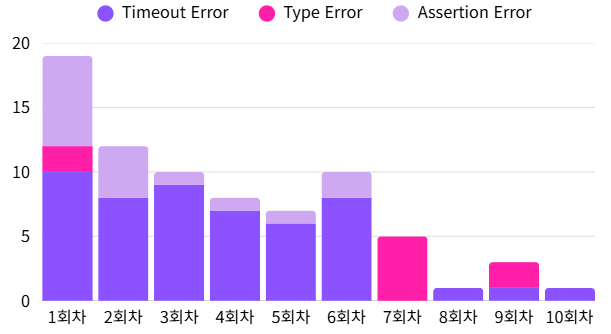
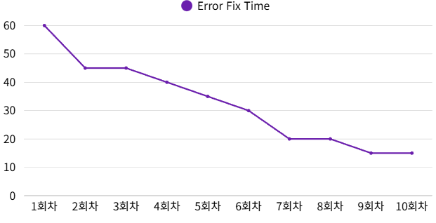
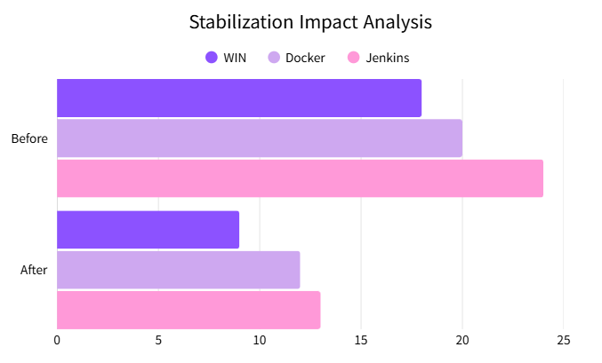

# 🐞 Elice BugsHunters 🐞

Elice BugsHunters는 엘리스 플랫폼의 AI Helpy Chat 웹 애플리케이션을 대상으로 한
자동화 테스트 & 버그 헌팅 프로젝트입니다.<br>

Selenium + pytest 기반 E2E 테스트와 Docker/Jenkins 기반 CI 환경을 포함합니다.

## 📌 프로젝트 소개 (Overview)

- 대상 서비스: Elice AI Helpy Chat
- 목적: 반복되는 기능 테스트를 자동화
- 특징:
  - Page Object Model(POM) 기반 구조
  - 명시적 대기를 활용한 안정적인 테스트
  - CI 환경(Jenkins, Docker) 연동
  - 반복 업무 자동화를 통한 생산성 향상
  - 테스트 파이프라인 구축
  - Jira로 이슈 자동 생성

## 🧰 Tech Stack

- **Language**: Python (3.14+ 권장)
- **Test Framework**: pytest 8.3.3
- **Browser Automation**: Selenium WebDriver 4.25.0 (Chrome)
- **CI/CD**: Jenkins
- **Container**: Docker, docker-compose
- **테스트케이스 관리**: JIRA

<p align="center">
  
  
  
  
  
</p>

## 🏗️ 프로젝트 구조


## 🔍 테스트 대상 페이지

- Account  (AC)
  - 계정 로그인/로그아웃/회원 가입, 유효성 검사, 공백 검사

- Chat Base (CB)
  - 메시지 전송, 응답 검증, 파일 업로드, 답변 복사, 질문 수정기능

- Chat Expanse (CE)
  - 이미지 생성/ 퀴즈/Google 검색/ PPT 생성/심층조사/파일업로드 등 확장기능, 공백 검사, <br>응답 검증, Explorer 검색

- Custom Agent (CA)
  - 커스텀 에이전트 생성 / 수정 / 삭제 / 임시저장 자동화
  - 이름 중복, 유효성 검사, 파일 업로드(사이즈 제한 포함) 검증
  - Agent Explorer·My Agents에서 카드 노출 & ID 기반 탐색 로직 검증
  - 권한 기반 동작(읽기/삭제/수정 제한) 검증
  - 동적 UI 요소와 사용자 편의성 검증

- Chat History (HT)
  - 히스토리 검색, 

## 😎 Challenges & Solutions 

|문제|해결|결과|
|---|---|---|
|conftest 충돌|각 환경에서 만든 필수 요소를 뽑아서 병합|여러 환경에서도 큰 격차 없이 작동|
|Jenkins-jira 연결 오류|summary 전체 일치 검색으로 JQL 구조 변경|기존 테스트 검색 성공|
|driver 스코프(session)로 인한 상태 간섭|테스트별 초기 상태를 보장하기 위해 scope="module"설정|순서독립성 확보, flaky 감소, 동적 UI 테스트 안정성 향상|


## ⭐ Our Key Points 
- 자동화를 위한 표준 템플릿 지정
- 사용자 편의성을 검증하기 위한 사용자 흐름 중심 테스트
- 테스트 흐름에 맞춘 핵심 기능 자동화
- Docker와 Jenkins를 이용해 Ci 구축 후 배포 전에도 자동화 테스트구축

## 🏗 Architecture (Page Object Model)

- `src/pages/base_page.py` : 모든 페이지 객체(POM)의 공통 부모 클래스입니다. 각 페이지에서 자주 사용하는 대기 + 요소 조회 + 안전 클릭 로직을 한 곳에 모아 재사용합니다.

- `src/pages/billing_page.py` : AI Helpy Chat의 결제/과금 영역(크레딧 사용 내역, 결제 수단 등록, 다날 카드 결제창, 이용내역·ML API·Serverless 상태·API 키 관리)을 자동으로 열고 조작·검증하기 위한 Billing/Usage 전용 POM 클래스 묶음

- `src/pages/chat_base_page.py` : AI 채팅 화면에서 메시지 전송·응답 확인·파일 업로드·복사·편집·스크롤 등 주요 상호작용을 담당하는 Chat 페이지 POM 클래스

- `src/pages/chat_expanse_page.py` : AI Helpy Chat의 파일 업로드·퀴즈·PPT·이미지·구글 검색·심층 조사 등 “+ 버튼” 기반 확장 기능을 일괄 자동화·검증하는 통합 Chat 확장 POM 클래스

- `src/pages/custom_agent_page.py` : AI Helpy Chat의 에이전트 탐색·생성·관리 전 과정을 자동화·검증하기 위해 에이전트 관련 화면을 역할별 POM 클래스로 나눈 페이지 객체 묶음

- `src/pages/history_page.py` : AI Helpy Chat에서 대화 시작·메시지 전송·히스토리/검색·에이전트 탐색을 자동화하기 위한 핵심 화면들을 묶어 둔 POM 세트

- `src/pages/login_page.py` : AI Helpy Chat에서 로그인·회원가입·로그아웃·히스토리 초기화 등 계정 관련 흐름을 자동화하고 로그인 성공 여부를 검증하는 로그인 전용 POM 클래스

- `tests/` : 위 POM을 조합해서 E2E 시나리오 정의

## ⌛작업경과
|| |
|| |


## 🧪 주요 테스트 시나리오


## 📝 테스트케이스 관리


JIRA를 통해 관리


## 🚀 시작하기 (Getting Started)

### 1) 레포지토리 클론

```bash
git clone https://github.com/minojj/Elice-BugsHunters.git
cd Elice-BugsHunters
git checkout develop
```
### 2) 가상환경 생성 및 의존성 설치
```bash
python -m venv .venv

# Windows
.\.venv\Scripts\activate

# macOS / Linux
source .venv/bin/activate

pip install -r requirements.txt
```
## ⚙️ 환경 변수 설정 (.env)
프로젝트 루트에 .env 파일을 생성하고 다음과 같이 설정합니다.
```bash
MAIN_EMAIL=...
MAIN_PASSWORD=...


SUB_EMAIL=...
SUB_PASSWORD=...
```
## 🖥️ 테스트 실행 방법

### 전체테스트 실행
```bash
pytest
```
### Docker로 실행
```bash
docker build -t elice-test .
docker run --rm elice-test
```
## 🔗 Link
- https://tangibly-unadult-serina.ngrok-free.dev/ (Jenkins)
- https://nwwe.atlassian.net/jira/software/projects/Q31/boards/69 (Jira)

## 📋 테스트결과 요약
- pytest로 실행: 56개 케이스 중 56개 pass<br>

- docker로 실행: 56개 케이스 중 47개 pass 9개 fail

## 👥 Members

| 장민호 | 조예진 | 김준서 | 최윤영 | 이태경 |
|:------:|:------:|:------:|:------:|:------:|
|  |  |  |  |  |
| [](https://github.com/minojj) | [](https://github.com/yejin1024) | [](https://github.com/junseoseki) | [](https://github.com/nwweiit) | [](https://github.com/dlxorud1256) |
